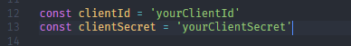

# GitHub Finder with React Native

GitHub Finder React Native V1.0.0 using Expo

## Overview


## Registering the OAuth GitHub token

Go to [Github Settings](https://github.com/settings/developers), and make a new application, after you making a new application, you gonna get _client_id_ and _client_secret_.

After that go to _./src/redux/actions_ and look for _githubActions.js_ file and search for this line.



Replace the value that you achieve from GitHub.

_This is important, when you make request to GitHub. You not gonna get a limited access for the request_

## Environment Setup

Please refer to the docs in here [React Native Docs](https://reactnative.dev/docs/environment-setup)

## Step To Install

These are step to install the React Native project

## Install dependencies

```
npm install
```

## Run android

```
npm start | expo start
```
